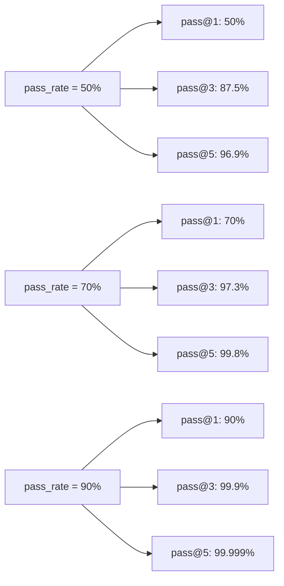

# Key Metrics: pass@k and pass^k for Code Generation Evaluation

> **How to measure code generation quality using statistical metrics that show what matters: reliability and consistency**

## 개요 (Overview)

코드 생성 모델을 평가할 때 가장 중요한 질문은 **"이 모델은 얼마나 신뢰할 수 있는가?"** 입니다.

단순히 "한 번 시도해서 성공했는가"가 아니라:

- **여러 번 시도했을 때 최소한 한 번은 성공할 확률**이 얼마나 되는가?
- **매번 일관되게 높은 수준의 코드를 생성할 수 있는가?**

이 문서는 코드 생성 평가에서 가장 널리 사용되는 두 가지 메트릭을 설명합니다:

1. **pass@k** - 최소한 하나 성공 (At least one success)
2. **pass^k** - 모두 성공 (All successes)

---

## 1. pass@k: 최소한 하나의 성공 (At Least One Success)

### 1.1 개념 (Concept)

**pass@k** 는 **k번의 시도 중에 최소한 하나의 성공을 얻을 확률**을 나타냅니다.

간단한 정의:
- k번의 서로 다른 샘플을 생성
- 각 샘플이 테스트를 통과하는지 확인
- **최소한 하나 이상이 통과했으면 pass@k = 1**

### 1.2 수학 공식 (Mathematical Formula)

```
pass@k = 1 - (1 - pass_rate)^k

여기서:
- pass_rate = 단일 시도의 성공률
- k = 시도 횟수
```

#### 단계별 계산 (Step-by-Step Calculation)

```
pass@k를 계산하는 방법:

1. 단일 샘플 성공률 계산: pass_rate = successful / total

2. 실패 확률 계산: failure_rate = 1 - pass_rate

3. k번 모두 실패할 확률: all_failed = failure_rate^k

4. 최소 하나 성공: pass@k = 1 - all_failed
```

### 1.3 실제 예제 (Practical Examples)

#### 예제 1: 기본 계산

```
상황: 모델의 단일 시도 성공률이 70%일 때

pass@1 = 1 - (1 - 0.7)^1 = 1 - 0.3 = 70%
pass@3 = 1 - (1 - 0.7)^3 = 1 - (0.3)^3 = 1 - 0.027 = 97.3%
pass@5 = 1 - (1 - 0.7)^5 = 1 - (0.3)^5 = 1 - 0.00243 ≈ 99.76%

결론: 70% 성공률로도 3번 시도하면 97% 이상 성공 보장
```

#### 예제 2: 낮은 성공률에서의 pass@k

```
상황: 모델의 단일 시도 성공률이 30%일 때

pass@1 = 1 - (1 - 0.3)^1 = 30%
pass@3 = 1 - (1 - 0.3)^3 = 1 - 0.343 = 65.7%
pass@5 = 1 - (1 - 0.3)^5 = 1 - 0.16807 ≈ 83.2%
pass@10 = 1 - (1 - 0.3)^10 ≈ 97.2%

결론: 낮은 성공률이면 높은 신뢰도를 위해 더 많은 시도 필요
```

### 1.4 시각화 (Visualization)

```
pass@k 확률 증가 패턴

성공률 70%일 때:
┌────────────────────────────────────────┐
│ pass@k 증가 추이                        │
├────────────────────────────────────────┤
│ pass@1: ████████████████░ 70%          │
│ pass@2: ███████████████████░ 91%       │
│ pass@3: ██████████████████░░ 97%       │
│ pass@5: ███████████████████░░ 99.8%    │
│ pass@10: ████████████████████░ 99.9999%│
└────────────────────────────────────────┘

특징:
- k가 증가할수록 확률이 빠르게 증가
- 수렴 속도는 기본 성공률에 따라 결정
- k가 충분하면 거의 100%에 가까워짐
```

#### Mermaid 다이어그램 (Visualization with Different Success Rates)



### 1.5 언제 사용하는가? (When to Use)

**pass@k를 사용하는 경우:**

1. **재시도 가능한 환경**
   - 자동화된 작업 처리
   - 배치 작업 시스템
   - 비용이 낮은 재시도

2. **신뢰도가 중요한 경우**
   - "최소한 한 번은 맞는 코드를 얻을 확률"이 중요
   - 사용자가 여러 옵션 중에서 선택 가능
   - 자동화 시스템이 여러 샘플 병렬 처리 가능

3. **실제 사용 사례**
   - 테스트 케이스 생성 (3개 중 최소 1개 유효한 케이스 필요)
   - 버그 픽스 제안 (5개 중 1개라도 작동하는 픽스)
   - 최적화 검색 (10개 중 빠른 코드 찾기)
   - 다중 경로 탐색 (병렬로 여러 구현 시도)

---

## 2. pass^k: 모든 시도가 성공 (All Successes)

### 2.1 개념 (Concept)

**pass^k** (다르게 표기: pass-all@k, all-pass@k) 는 **k번의 시도 모두가 일관되게 성공할 확률**을 나타냅니다.

주요 특징:
- k번 생성한 샘플이 **모두 테스트 통과**해야 함
- **일관성(consistency)을 측정**
- 모델의 **안정성(reliability)**을 평가

### 2.2 수학 공식 (Mathematical Formula)

```
pass^k = pass_rate^k

여기서:
- pass_rate = 단일 시도의 성공률
- k = 시도 횟수
```

### 2.3 실제 예제 (Practical Examples)

#### 예제 1: 기본 계산

```
상황: 모델의 단일 시도 성공률이 70%일 때

pass^1 = 0.7^1 = 70%
pass^2 = 0.7^2 = 49%
pass^3 = 0.7^3 = 34.3%
pass^5 = 0.7^5 = 16.8%
pass^10 = 0.7^10 ≈ 2.82%

결론: 모두 성공을 요구하면 확률이 급격히 감소
```

#### 예제 2: 높은 성공률에서의 pass^k

```
상황: 모델의 단일 시도 성공률이 95%일 때

pass^1 = 0.95^1 = 95%
pass^2 = 0.95^2 = 90.25%
pass^3 = 0.95^3 = 85.74%
pass^5 = 0.95^5 ≈ 77.4%
pass^10 = 0.95^10 ≈ 59.9%

결론: 높은 기본 성공률도 k가 증가하면 모두 성공은 어려움
```

### 2.4 시각화 (Visualization)

```
pass^k 확률 감소 패턴

성공률 70%일 때:
┌────────────────────────────────────────┐
│ pass^k 감소 추이                        │
├────────────────────────────────────────┤
│ pass^1: ██████████░ 70%               │
│ pass^2: ███████░░░ 49%                │
│ pass^3: ████░░░░░░ 34.3%              │
│ pass^5: ██░░░░░░░░ 16.8%              │
│ pass^10: █░░░░░░░░░ 2.8%              │
└────────────────────────────────────────┘

특징:
- k가 증가할수록 확률이 빠르게 감소
- 모두 성공을 요구하는 것은 매우 어려움
- 높은 기본 성공률도 도움이 되지만 불충분
```

### 2.5 언제 사용하는가? (When to Use)

**pass^k를 사용하는 경우:**

1. **일관성이 필수인 경우**
   - 프로덕션 배포 전 품질 보증
   - 모든 샘플이 동일한 수준의 품질 필요
   - "100% 신뢰할 수 있는 모델"을 증명해야 함

2. **여러 번 실행해야 하는 경우**
   - 멀티샘플 앙상블 (모든 샘플 결합)
   - 병렬 처리 후 모든 결과 통합
   - 여러 케이스 모두 처리

3. **실제 사용 사례**
   - 보안 관련 코드 (모든 버전이 안전해야 함)
   - 금융 계산 (모든 구현이 정확해야 함)
   - API 스펙 생성 (모든 버전이 호환성 있어야 함)
   - 모니터링 시스템 (여러 체크 모두 통과)

---

## 3. pass@k vs pass^k: 비교 및 선택 기준

### 3.1 비교 표 (Comparison Table)

| 측면 | pass@k | pass^k |
|------|--------|--------|
| **정의** | 최소 하나 성공 | 모두 성공 |
| **수식** | 1 - (1 - p)^k | p^k |
| **확률 변화** | 증가 ↗ | 감소 ↘ |
| **기본 개념** | 낙관적(optimistic) | 비관적(pessimistic) |
| **측정 대상** | 신뢰도(reliability) | 일관성(consistency) |
| **k=1 시** | 동일 (p) | 동일 (p) |
| **k 증가 시** | 빠르게 증가 | 빠르게 감소 |
| **사용 시나리오** | 재시도 가능 | 모두 완벽 필요 |

### 3.2 선택 기준 (Selection Criteria)

```
의사결정 플로우차트:

┌─────────────────────────────────────┐
│ 평가 목적: 무엇을 알고 싶은가?       │
└──────────┬──────────────────────────┘
           │
     ┌─────┴─────┐
     │           │
     v           v
┌──────────┐ ┌──────────────┐
│ 최소한    │ │ 모두 완벽한   │
│ 하나      │ │ 품질 필요     │
│ 작동?     │ │              │
└─────┬────┘ └──────┬───────┘
      │             │
      v             v
  pass@k         pass^k

특징:            특징:
- 3번 시도      - 5번 모두
- 하나라도 OK   - 완벽 필요
- 낙관적        - 비관적
```

### 3.3 실무 적용 예제 (Practical Application)

#### 케이스 1: 웹 스크래퍼 생성

```
상황: 모델이 웹 스크래퍼 코드를 생성
      - 성공률: 65%
      - 3번 생성하는 비용: 저렴 ($0.10)

평가:
pass@3 = 1 - (1-0.65)^3 = 1 - 0.042875 = 95.7%

의사결정:
✓ pass@3 사용 (사용자가 3개 중 최소 1개 선택 가능)
✓ 사용자는 95.7% 확률로 적어도 하나의 작동 코드 획득
✓ 비용 대비 효과 우수
```

#### 케이스 2: 보안 라이브러리 코드 생성

```
상황: 모델이 암호화 라이브러리 코드 생성
      - 성공률: 85%
      - 사용처: 프로덕션 금융 시스템
      - 요구사항: 모든 샘플 완벽해야 함

평가:
pass@5 = 1 - (1-0.85)^5 = 99.99%  ← 최소 하나
pass^5 = 0.85^5 = 44.4%             ← 모두 성공

의사결정:
✗ pass@5 의존 불가능 (재시도 불가)
✓ pass^5 = 44.4% → 모두 성공 확률 너무 낮음
→ 모델 개선 필요 (85% 성공률 부족)
→ 90%+ 성공률 달성 후 재평가
```

---

## 4. Anthropic 평가 로드맵 (Anthropic's Evaluation Roadmap)

### 4.1 개요

Anthropic은 Claude 모델의 코드 생성 능력을 평가하기 위한 체계적인 8단계 프로세스를 정의했습니다.

### 4.2 8단계 평가 로드맵 (8-Step Evaluation Roadmap)

```
단계별 평가 프로세스:

Stage 1: 기초 설정 (Foundation)
  ├─ 평가 데이터셋 선정
  ├─ 테스트 방법 정의
  └─ 메트릭 결정 (pass@k vs pass^k)

Stage 2: 단일 샘플 평가 (Single-Sample Evaluation)
  ├─ 각 문제마다 1회 생성
  ├─ pass@1 계산
  └─ 기본 성능 파악

Stage 3: 다중 샘플 생성 (Multi-Sample Generation)
  ├─ 각 문제마다 k개 샘플 생성
  ├─ k = 3, 5, 10 등 다양한 값 시도
  └─ 통계적 신뢰도 확보

Stage 4: 신뢰도 분석 (Reliability Analysis)
  ├─ pass@k 계산 (최소 하나 성공)
  ├─ 확률 곡선 분석
  └─ k에 따른 개선 정도 측정

Stage 5: 일관성 분석 (Consistency Analysis)
  ├─ pass^k 계산 (모두 성공)
  ├─ 모델의 안정성 평가
  └─ 어느 k에서 모두 성공이 불가능한지 파악

Stage 6: 오류 분류 (Error Classification)
  ├─ 실패한 샘플 분석
  ├─ 공통 오류 패턴 식별
  └─ 개선 영역 특정

Stage 7: 비교 평가 (Comparative Evaluation)
  ├─ 다른 모델과 비교
  ├─ pass@k 및 pass^k 벤치마킹
  └─ 상대적 성능 위치 파악

Stage 8: 배포 결정 (Deployment Decision)
  ├─ 평가 결과 종합
  ├─ 임계값 설정 (필요한 pass@k ≥ 95%?)
  └─ 프로덕션 배포 결정
```

### 4.3 단계별 상세 설명 (Detailed Breakdown)

#### Stage 1: 기초 설정 (Foundation Setup)

```
주요 결정사항:

1. 평가 데이터셋
   - 문제 선택: LeetCode? HumanEval? 자체 데이터셋?
   - 샘플 크기: 100개? 500개? 1,000개?
   - 난이도 분포: 쉬움 30%, 중간 50%, 어려움 20%?

2. 테스트 정확도
   - Unit test 실행?
   - AST 파싱?
   - 동적 실행?

3. 메트릭 결정
   - pass@k만 사용?
   - pass^k도 함께?
   - 다른 메트릭도? (예: 시간 복잡도, 스타일)

체크리스트:
[ ] 데이터셋 확정
[ ] 테스트 방법 검증
[ ] 메트릭 정의 완료
```

#### Stage 2: 단일 샘플 평가 (Single-Sample)

```
프로세스:

For each problem in dataset:
  1. 모델에 문제 입력
  2. 하나의 샘플 생성
  3. 테스트 실행
  4. 통과/실패 기록

결과: pass@1 값 계산

예시:
문제 1: LCM 계산 → 생성 → 통과 ✓
문제 2: 배열 정렬 → 생성 → 실패 ✗
문제 3: 피보나치 → 생성 → 통과 ✓
...
결과: 75개 통과 / 100개 = pass@1 = 75%
```

#### Stage 3: 다중 샘플 생성 (Multi-Sample Generation)

```
프로세스:

For each problem in dataset:
  For k in [1, 3, 5, 10]:
    1. k개의 서로 다른 샘플 생성
       (temperature 조정, seed 다양화)
    2. 각 샘플마다 테스트 실행
    3. 결과 기록

결과 데이터:
{
  "problem_id": 1,
  "samples": [
    {"code": "...", "passed": true},
    {"code": "...", "passed": false},
    {"code": "...", "passed": true}
  ]
}

추가 정보:
- 생성 시간 추적
- 토큰 사용량 기록
- 온도/seed 설정 저장
```

#### Stage 4: 신뢰도 분석 (Reliability Analysis)

```
계산:

For each k in [1, 3, 5, 10]:
  pass@k = (최소 하나 성공한 문제 수) / (전체 문제 수)

예시 계산:
문제 1: 샘플[✓, ✗, ✓] → pass@3 = 1 (최소 하나 성공)
문제 2: 샘플[✗, ✗, ✗] → pass@3 = 0 (모두 실패)
문제 3: 샘플[✓, ✓, ✓] → pass@3 = 1 (모두 성공)
...
pass@3 = (통과한 문제 수) / 100

시각화:
k=1: ████████░░ 80%
k=3: ███████████░░ 92%
k=5: ████████████░ 94%
k=10: ████████████░ 95%
```

#### Stage 5: 일관성 분석 (Consistency Analysis)

```
계산:

For each k in [1, 3, 5, 10]:
  pass^k = (모두 성공한 문제 수) / (전체 문제 수)

예시 계산:
문제 1: 샘플[✓, ✗, ✓] → pass^3 = 0 (모두 성공 아님)
문제 2: 샘플[✗, ✗, ✗] → pass^3 = 0 (실패)
문제 3: 샘플[✓, ✓, ✓] → pass^3 = 1 (모두 성공!)
...
pass^3 = (모두 성공한 문제 수) / 100

시각화:
k=1: ████████░░ 80%   (pass@1과 동일)
k=3: ██████░░░░ 60%   (크게 감소)
k=5: ████░░░░░░ 35%   (더욱 감소)
k=10: ██░░░░░░░░ 12%  (매우 낮음)

해석:
- pass^k가 급격히 감소 → 모델 불안정
- 여러 번 실행해도 일관성 부족
```

#### Stage 6: 오류 분류 (Error Classification)

```
실패 샘플 분석:

For each failed sample:
  1. 오류 타입 분류
  2. 패턴 식별
  3. 빈도 계산

오류 분류 예시:
┌──────────────────┬────────┬──────┐
│ 오류 타입         │ 빈도   │ 비율 │
├──────────────────┼────────┼──────┤
│ 문법 오류         │ 45개   │ 37% │
│ 논리 오류         │ 35개   │ 28% │
│ 엣지 케이스 미처리│ 25개   │ 20% │
│ 시간복잡도 초과   │ 12개   │ 10% │
│ 기타              │ 5개    │ 5%  │
└──────────────────┴────────┴──────┘

개선 전략:
- 문법 오류 → 코드 완성 모델 개선 필요
- 논리 오류 → 문제 이해도 향상 필요
- 엣지 케이스 → 테스트 케이스 강화 필요
```

#### Stage 7: 비교 평가 (Comparative Evaluation)

```
벤치마킹:

모델 A: Claude 3.5 Haiku
- pass@1: 70%
- pass@3: 92%
- pass@5: 97%
- pass^3: 45%
- pass^5: 25%

모델 B: Claude 3 Opus
- pass@1: 80%
- pass@3: 96%
- pass@5: 98%
- pass^3: 58%
- pass^5: 35%

모델 C: GPT-4o
- pass@1: 75%
- pass@3: 94%
- pass@5: 97%
- pass^3: 51%
- pass^5: 30%

결론:
- Opus: 신뢰도 최고 (pass@5: 98%)
- Opus: 일관성도 최고 (pass^5: 35%)
- Haiku: 비용대비 효율 우수
```

#### Stage 8: 배포 결정 (Deployment Decision)

```
의사결정 로직:

평가 결과 ─┬─ pass@k >= 95%? ─┬─ Yes → 프로덕션 배포
           │                 └─ No → 다시 평가
           │
           ├─ pass^k >= 50%? ─┬─ Yes → 신뢰할 수 있는 모델
           │                 └─ No → 일관성 개선 필요
           │
           └─ 오류 분류 ─┬─ 주요 오류 명확? ─┬─ Yes → 특정 개선
                        └─ 분산 오류? → 전반 개선

배포 체크리스트:
[ ] pass@5 >= 95%
[ ] pass^5 >= 30%
[ ] 오류 패턴 식별 완료
[ ] 성능 회귀 없음
[ ] 사용 비용 승인
[ ] 모니터링 계획 수립
```

### 4.4 평가 로드맵 시각화 (Evaluation Roadmap Flow)

```
┌─────────────────────────────────────────────────────────┐
│ Stage 1: 기초 설정                                       │
│ - 데이터셋 선정 (100-1000 문제)                         │
│ - 테스트 방법 정의                                       │
│ - 메트릭 선택 (pass@k, pass^k)                         │
└────────────────┬────────────────────────────────────────┘
                 ▼
┌─────────────────────────────────────────────────────────┐
│ Stage 2: 단일 샘플 (pass@1)                             │
│ 각 문제당 1개 샘플 생성 및 테스트                        │
└────────────────┬────────────────────────────────────────┘
                 ▼
┌─────────────────────────────────────────────────────────┐
│ Stage 3: 다중 샘플 (k=3,5,10)                           │
│ 각 문제당 여러 샘플 생성                                 │
└────────────────┬────────────────────────────────────────┘
                 ▼
       ┌─────────┴──────────┐
       ▼                    ▼
┌────────────────┐   ┌──────────────────┐
│ Stage 4: 신뢰도│   │ Stage 5: 일관성  │
│ pass@k 계산    │   │ pass^k 계산      │
└────────┬───────┘   └────────┬─────────┘
         │                    │
         └─────────┬──────────┘
                   ▼
        ┌────────────────────────┐
        │ Stage 6: 오류 분석      │
        │ 실패 패턴 식별          │
        └────────┬───────────────┘
                 ▼
        ┌────────────────────────┐
        │ Stage 7: 비교 평가      │
        │ 다른 모델과 벤치마킹    │
        └────────┬───────────────┘
                 ▼
        ┌────────────────────────┐
        │ Stage 8: 배포 결정      │
        │ 최종 의사결정           │
        └────────────────────────┘
```

---

## 5. 실제 예제: HumanEval 데이터셋 평가

### 5.1 평가 시나리오

```
데이터셋: HumanEval (164개 문제)
모델: Claude 3.5 Sonnet
목표: pass@k, pass^k 계산 및 배포 결정

평가 설정:
- k values: [1, 3, 5, 10]
- 온도: 0.8 (다양성)
- 시간 제한: 10초/샘플
```

### 5.2 실제 결과 시뮬레이션

```python
# 평가 결과 (가상 데이터)

results = {
    "problem_1": {
        "name": "HCF 계산",
        "samples_k5": [True, False, True, False, True],
        # pass@5: 1 (최소 하나 성공)
        # pass^5: 0 (모두 성공 아님)
    },
    "problem_2": {
        "name": "배열 정렬",
        "samples_k5": [True, True, True, True, True],
        # pass@5: 1 (최소 하나 성공)
        # pass^5: 1 (모두 성공!)
    },
    "problem_3": {
        "name": "트리 순회",
        "samples_k5": [False, False, False, False, False],
        # pass@5: 0 (모두 실패)
        # pass^5: 0 (모두 성공 아님)
    },
}

# 계산 결과
pass_at_1 = 132 / 164 = 80.5%
pass_at_3 = 158 / 164 = 96.3%
pass_at_5 = 161 / 164 = 98.2%
pass_at_10 = 163 / 164 = 99.4%

pass_all_at_3 = 95 / 164 = 57.9%
pass_all_at_5 = 72 / 164 = 43.9%
pass_all_at_10 = 42 / 164 = 25.6%
```

### 5.3 결과 분석

```
해석:

신뢰도 (pass@k):
✓ pass@5 = 98.2% (매우 좋음)
  → 5번 시도하면 98% 확률로 적어도 하나의 성공 코드 획득

일관성 (pass^k):
⚠ pass^5 = 43.9% (낮음)
  → 5번 모두 성공할 확률은 44%에 불과함
  → 모델이 불안정한 경우도 존재

배포 결정:
✓ 자동화 시스템 배포 가능
  (재시도 로직 포함, pass@5 활용)

⚠ 일관성 모니터링 필요
  (pass^k 개선을 위한 모델 재교육 고려)

최종 권장사항:
1. 사용자 선택 기반: 3-5개 샘플 생성 및 선택 제공
2. 자동 배포: 3개 샘플 중 1개라도 통과 시 배포
3. 모니터링: pass^k 개선을 위한 피드백 수집
```

---

## 6. 평가 메트릭 선택 가이드

### 6.1 의사결정 트리

```
┌──────────────────────────────┐
│ 코드 생성 모델 평가 시 질문   │
└──────────────┬───────────────┘
               │
               v
     ┌─────────────────────┐
     │ 재시도가 가능한가?  │
     └─────────┬───────────┘
         Yes ┌─┘
             v
     ┌──────────────────────┐
     │ "최소한 하나가       │
     │ 작동하면 되는가?"    │
     └──────┬───────────────┘
        Yes v
     pass@k 사용 ✓

     No ┌──────────────────────┐
         │ "모든 샘플이        │
         │ 완벽해야 하는가?"   │
         └──────┬───────────────┘
            Yes v
         pass^k 사용 ✓

                No v
         ┌──────────────────────┐
         │ 다른 메트릭 필요     │
         │ (BLEU, 시간복잡도)  │
         └──────────────────────┘
```

### 6.2 도메인별 권장사항

```
┌────────────────────┬──────────────┬──────────────┐
│ 도메인             │ 추천 메트릭   │ 임계값      │
├────────────────────┼──────────────┼──────────────┤
│ 자동 테스트 생성    │ pass@5       │ ≥ 95%      │
│ 버그 수정 제안      │ pass@3       │ ≥ 80%      │
│ 코드 스니펫        │ pass@1       │ ≥ 75%      │
│ API 구현           │ pass@5       │ ≥ 92%      │
│ 보안 코드          │ pass^5       │ ≥ 70%      │
│ 금융 알고리즘      │ pass^5       │ ≥ 80%      │
│ 웹 스크래퍼        │ pass@3       │ ≥ 85%      │
│ 데이터 처리        │ pass@3       │ ≥ 90%      │
└────────────────────┴──────────────┴──────────────┘
```

---

## 7. 모니터링 및 반복 개선

### 7.1 지속적 평가 (Continuous Evaluation)

```
평가 주기:

Week 1: Stage 1-3 (기초 설정 및 다중 샘플)
Week 2: Stage 4-5 (신뢰도 및 일관성 분석)
Week 3: Stage 6-7 (오류 분석 및 비교)
Week 4: Stage 8 (배포 결정 및 모니터링)

지속적 모니터링:
- 주간: 신규 데이터셋 10% 샘플 평가
- 월간: 전체 벤치마크 재실행
- 분기: 임계값 재검토 및 조정
```

### 7.2 개선 루프 (Improvement Loop)

```
┌────────────────────────────────┐
│ 현재 성능 측정                 │
│ pass@5: 94%, pass^5: 38%      │
└────────────┬───────────────────┘
             ▼
┌────────────────────────────────┐
│ 오류 분석                      │
│ - 논리 오류: 45%              │
│ - 엣지 케이스: 35%            │
│ - 시간 제한: 20%              │
└────────────┬───────────────────┘
             ▼
┌────────────────────────────────┐
│ 개선 계획                      │
│ 1. 프롬프트 개선              │
│ 2. 샘플 다양성 증대            │
│ 3. 테스트 케이스 강화           │
└────────────┬───────────────────┘
             ▼
┌────────────────────────────────┐
│ 개선 구현 및 재평가             │
│ pass@5 목표: 97%              │
│ pass^5 목표: 45%              │
└────────────┬───────────────────┘
             ▼
         성능 향상? ─ No → 다시
             │
            Yes
             ▼
        배포 또는 추가 개선
```

---

## 요약 (Summary)

### 핵심 개념 (Key Takeaways)

1. **pass@k**: 최소 하나 성공을 측정 → 신뢰도 평가
   - 재시도 가능한 시스템에서 유용
   - k가 증가할수록 확률 증가
   - 사용자 선택 기반 시스템에 적합

2. **pass^k**: 모두 성공을 측정 → 일관성 평가
   - 완벽한 안정성이 필요할 때 사용
   - k가 증가할수록 확률 급격히 감소
   - 프로덕션 품질 보증에 적합

3. **Anthropic 8단계 로드맵**: 체계적 평가 프로세스
   - 기초 설정 → 단일 샘플 → 다중 샘플
   - 신뢰도/일관성 분석 → 오류 분류
   - 비교 평가 → 배포 결정

4. **메트릭 선택**: 사용 목적에 따라 결정
   - 자동화 시스템 → pass@k
   - 프로덕션 품질 → pass^k
   - 중요 애플리케이션 → 둘 다 모니터링

### 실무 적용 (Practical Application)

```bash
# 평가 스크립트 템플릿

evaluate_model.sh:
1. 데이터셋 로드
2. 각 문제마다 k개 샘플 생성
3. 테스트 실행 및 결과 기록
4. pass@k, pass^k 계산
5. 결과 시각화
6. 배포 결정 도출
```

더 많은 실제 구현 예제는 다음 문서를 참고하세요:
- `04-statistical-significance.md` - 통계적 유의성
- `06-advanced-metrics.md` - 고급 메트릭

---

**Last Updated**: 2026-01-25
**Document Version**: 1.0
**Audience**: ML Engineers, Model Evaluators, DevOps Engineers
