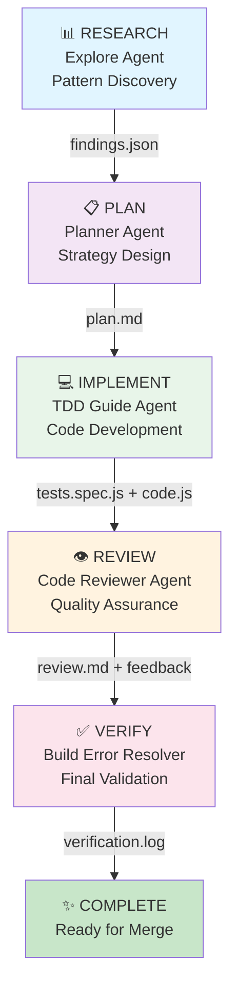

# Orchestrator with Sequential Phases Pattern

## 개요 (Overview)

**Sequential Phases Pattern**은 복잡한 작업을 **5개의 명확한 단계**로 분리하는 orchestration 패턴입니다. 각 단계는 전문화된 에이전트가 담당하며, 이전 단계의 출력이 다음 단계의 입력이 됩니다.

**핵심 원칙**: 한 가지씩 명확하게 → 다음 단계로 전달 → 절대 단계를 건너뛰지 않음

이 패턴은 **품질을 보장하고, 실수를 줄이며, 각 단계를 독립적으로 검증**할 수 있게 해줍니다.

---

## 🔄 5 Sequential Phases (5개 순차 단계)

### Phase Flow Diagram



---

## Phase 1: RESEARCH 🔬

### Purpose (목적)

기존 코드베이스에서 **패턴, 아키텍처, 관례를 발견**합니다. 이 정보가 이후 모든 단계의 기초가 됩니다.

### Agent: Explore Agent
- **Model**: Haiku (빠른 검색)
- **Specialty**: 패턴 매칭, 파일 검색, 코드 구조 분석

### Input (입력)

```json
{
  "task": "Implement real-time notification feature",
  "context": {
    "file_to_analyze": "src/",
    "search_patterns": [
      "existing event systems",
      "WebSocket usage",
      "async patterns",
      "error handling conventions"
    ]
  }
}
```

### Key Activities (주요 활동)

1. **Pattern Discovery** - 기존 구현 패턴 찾기
   ```
   ✓ 이벤트 시스템 어디에 있나?
   ✓ WebSocket은 어떻게 구현되어 있나?
   ✓ 비동기 처리는 어떤 방식인가?
   ✓ 에러 처리 관례는?
   ```

2. **Architecture Understanding** - 구조 파악
   ```
   ✓ 서비스 간 통신 방식
   ✓ 의존성 구조
   ✓ 설정 방식
   ✓ 로깅 방식
   ```

3. **Existing Code Review** - 코드 검토
   ```
   ✓ 비슷한 기능 찾기
   ✓ 코딩 스타일 파악
   ✓ 테스트 패턴 이해
   ✓ 구조적 제약사항 파악
   ```

### Output (출력)

**findings.json** - 구조화된 발견사항

```json
{
  "patterns_found": {
    "event_system": {
      "location": "src/events/EventEmitter.ts",
      "pattern": "Observer pattern with pub/sub",
      "existing_events": [
        "user:login",
        "user:logout",
        "data:updated"
      ],
      "extension_point": "EventEmitter.register()"
    },
    "websocket_usage": {
      "location": "src/ws/WebSocketServer.ts",
      "pattern": "Socket.io with namespace support",
      "namespaces": ["/chat", "/notifications"],
      "connection_handler": "handleConnection()"
    },
    "async_patterns": {
      "promise_style": "async/await",
      "error_handling": "try/catch + error middleware",
      "timeout_convention": "3000ms default"
    }
  },
  "architectural_insights": {
    "service_layer": "src/services/",
    "middleware": "src/middleware/",
    "models": "src/models/",
    "conventions": [
      "Camel case for methods",
      "SCREAMING_SNAKE_CASE for constants",
      "Error classes extend BaseError"
    ]
  },
  "similar_implementations": [
    {
      "feature": "Chat notifications",
      "location": "src/features/chat/notifications.ts",
      "learnings": "Successfully handles 1000+ concurrent connections"
    }
  ],
  "constraints": [
    "WebSocket namespace limit: max 50",
    "Event emission max retries: 3",
    "Connection timeout: 5000ms"
  ]
}
```

### Quality Checklist ✅

- [ ] 모든 관련 파일 검색 완료
- [ ] 기존 패턴 명확히 식별
- [ ] 아키텍처 제약사항 문서화
- [ ] findings.json 파일로 저장

---

## Phase 2: PLAN 📐

### Purpose (목적)

RESEARCH 단계의 발견사항을 바탕으로 **구현 전략을 설계**합니다. 이 단계에서 "어떻게 할 것인가"를 명확히 정합니다.

### Agent: Planner Agent (Prometheus)
- **Model**: Opus (전략적 추론)
- **Specialty**: 아키텍처 설계, 의사결정, 계획 수립

### Input (입력)

RESEARCH 단계의 **findings.json**

```json
{
  "findings": "findings.json 파일 내용",
  "requirements": {
    "feature": "Real-time notifications",
    "constraints": [
      "Must work with existing event system",
      "Support 1000+ concurrent users",
      "Handle reconnection gracefully"
    ]
  }
}
```

### Key Activities (주요 활동)

1. **Decision Making** - 설계 결정
   ```
   ✓ 기존 EventEmitter 확장할 것인가, 새로 만들 것인가?
   ✓ WebSocket 기존 구현 사용?
   ✓ DB에 저장? 메모리? 하이브리드?
   ✓ 재시도 로직 필요?
   ```

2. **Architecture Design** - 아키텍처 설계
   ```
   ✓ 새로운 module 구조
   ✓ 서비스 간 상호작용
   ✓ 데이터 흐름
   ✓ 에러 처리 전략
   ```

3. **Implementation Strategy** - 구현 전략
   ```
   ✓ 파일 목록 및 생성 순서
   ✓ 의존성 관계
   ✓ 테스트 전략
   ✓ 단계별 구현 순서
   ```

### Output (출력)

**plan.md** - 상세 구현 계획

```markdown
# Implementation Plan: Real-time Notifications

## Architecture Decision

### 1. Extend Existing EventEmitter
**Decision**: Extend `src/events/EventEmitter.ts`
**Reasoning**:
- Already uses pub/sub pattern
- Well-tested, 1000+ user capability proven
- Minimal code changes required

**Design**:
```
EventEmitter (existing)
    ├── notification:created
    ├── notification:delivered
    └── notification:failed
```

### 2. Use Existing WebSocket with New Namespace
**Decision**: Add `/notifications` namespace to Socket.io
**Reasoning**:
- Reuse connection logic
- Namespace isolation prevents cross-talk
- Below 50-namespace limit

**Design**:
```
Socket.io
├── /chat (existing)
├── /notifications (new)
│   └── Handlers: on-create, on-ack, on-failed
└── /payments (existing)
```

## Implementation Sequence

### Step 1: Model Definition
**File**: `src/models/Notification.ts`
**Depends on**: Nothing
**Purpose**: Define notification schema

```typescript
interface INotification {
  id: string;
  userId: string;
  title: string;
  body: string;
  createdAt: Date;
  deliveredAt?: Date;
  status: 'pending' | 'delivered' | 'failed';
}
```

### Step 2: Service Layer
**File**: `src/services/NotificationService.ts`
**Depends on**: Notification model, EventEmitter
**Purpose**: Business logic

```typescript
export class NotificationService {
  async create(notification: INotification): Promise<void> {
    // Save to DB
    // Emit event
  }
}
```

### Step 3: WebSocket Handler
**File**: `src/ws/handlers/NotificationHandler.ts`
**Depends on**: NotificationService
**Purpose**: Handle real-time events

### Step 4: Test Suite
**Files**:
- `src/models/__tests__/Notification.spec.ts`
- `src/services/__tests__/NotificationService.spec.ts`
- `src/ws/__tests__/NotificationHandler.spec.ts`

### Step 5: Integration
**File**: `src/index.ts`
**Depends on**: All above
**Purpose**: Wire components together

## Error Handling Strategy

- Use existing error handling: `try/catch + middleware`
- Define `NotificationError extends BaseError`
- Retry logic: 3 attempts with exponential backoff
- Timeout: 3000ms (consistent with existing)

## Testing Strategy

- Unit tests: Each service in isolation
- Integration tests: Service + EventEmitter
- E2E tests: Socket.io connection + event flow

## Estimated Token Cost

- IMPLEMENT phase: ~15,000 tokens
- REVIEW phase: ~5,000 tokens
- VERIFY phase: ~3,000 tokens
- **Total**: ~23,000 tokens
```

### Quality Checklist ✅

- [ ] 모든 설계 결정 명확히 문서화
- [ ] 구현 순서 명시적
- [ ] 파일 목록 완전
- [ ] 의존성 명확
- [ ] plan.md 파일로 저장
- [ ] Planner agent 승인 획득

---

## Phase 3: IMPLEMENT 💻

### Purpose (목적)

PLAN 단계의 계획을 바탕으로 **실제 코드를 작성**합니다. TDD (Test-Driven Development) 접근법을 사용합니다.

### Agent: TDD Guide Agent
- **Model**: Sonnet (표준 코드 작성)
- **Specialty**: 코드 생성, TDD 패턴, 구현

### Input (입력)

PLAN 단계의 **plan.md**

```markdown
# Implementation Checklist

## Input
- plan.md: 상세 구현 계획
- findings.json: 코드베이스 패턴
- Step-by-step: 단계별로 진행

## Current Step
**Step 1: Model Definition**
- File: src/models/Notification.ts
- No dependencies
- TDD: Write tests first
```

### Key Activities (주요 활동)

1. **Test-First Development** - 테스트 먼저 작성
   ```typescript
   // ✅ FIRST: Write test
   describe('Notification Model', () => {
     it('should create notification with valid data', () => {
       // Test code
     });
   });

   // ✅ SECOND: Write implementation
   export class Notification {
     // Implementation
   }
   ```

2. **Follow Patterns** - 발견한 패턴 준수
   ```typescript
   // ✓ Use camelCase (pattern from RESEARCH)
   private notificationId: string;

   // ✓ Error handling (pattern from RESEARCH)
   try {
     // implementation
   } catch (error) {
     throw new NotificationError(error.message);
   }
   ```

3. **Complete One Step** - 한 단계씩 완료
   ```
   ✓ 한 파일씩 완성
   ✓ 해당 파일의 테스트 모두 작성
   ✓ 해당 파일의 구현 완성
   ✓ 다음 파일로 이동
   ```

### Output (출력)

**Code files + Test files**

```
src/
├── models/
│   ├── Notification.ts              ✅ Created
│   └── __tests__/
│       └── Notification.spec.ts     ✅ Created + All tests passing
├── services/
│   ├── NotificationService.ts       ✅ Created
│   └── __tests__/
│       └── NotificationService.spec.ts  ✅ Created + All tests passing
├── ws/
│   ├── handlers/
│   │   └── NotificationHandler.ts   ✅ Created
│   └── __tests__/
│       └── NotificationHandler.spec.ts ✅ Created + All tests passing
```

### Code Quality Standards

```typescript
// ✅ GOOD: Follows patterns from RESEARCH
async createNotification(notification: INotification): Promise<void> {
  try {
    // Save to DB
    await this.db.save(notification);

    // Emit event (following existing EventEmitter pattern)
    this.eventEmitter.emit('notification:created', notification);

  } catch (error) {
    // Follow error handling convention
    throw new NotificationError(`Failed to create notification: ${error.message}`);
  }
}

// ✅ GOOD: Comprehensive tests
describe('NotificationService', () => {
  describe('createNotification', () => {
    it('should save notification to database', async () => {
      // Test
    });

    it('should emit notification:created event', async () => {
      // Test
    });

    it('should throw NotificationError on database failure', async () => {
      // Test
    });

    it('should retry on transient failure', async () => {
      // Test
    });
  });
});
```

### Quality Checklist ✅

- [ ] 모든 파일 생성됨
- [ ] 모든 테스트 작성됨
- [ ] 모든 테스트 통과 (npm test)
- [ ] 코드 스타일 일관성
- [ ] 에러 처리 포함
- [ ] 주석 작성 완료
- [ ] PLAN의 모든 단계 완료

---

## Phase 4: REVIEW 👁️

### Purpose (목적)

IMPLEMENT 단계의 코드를 **전문적으로 검토**합니다. 버그, 성능 문제, 보안 취약점, 스타일 문제를 찾습니다.

### Agent: Code Reviewer Agent
- **Model**: Opus (정밀한 분석)
- **Specialty**: 코드 품질 분석, 버그 찾기, 아키텍처 검증

### Input (입력)

IMPLEMENT 단계의 **모든 코드 + 테스트**

```
Input files:
- src/models/Notification.ts
- src/services/NotificationService.ts
- src/ws/handlers/NotificationHandler.ts
- All __tests__/*.spec.ts files
```

### Key Activities (주요 활동)

1. **Code Quality Review** - 코드 품질 검토
   ```
   ✓ 스타일 일관성 확인
   ✓ 네이밍 규칙 확인
   ✓ 함수 크기 확인 (너무 길지 않은가?)
   ✓ 복잡도 측정
   ```

2. **Bug Detection** - 버그 찾기
   ```
   ✓ 잠재적 null reference
   ✓ Race condition
   ✓ 메모리 누수
   ✓ 타입 안정성
   ```

3. **Architecture Validation** - 아키텍처 검증
   ```
   ✓ PLAN과 구현이 일치하는가?
   ✓ 기존 패턴을 따르는가?
   ✓ 의존성이 명확한가?
   ✓ 책임이 명확하게 분리되어 있는가?
   ```

4. **Performance Analysis** - 성능 분석
   ```
   ✓ O(n) 루프가 있는가?
   ✓ 불필요한 데이터베이스 쿼리
   ✓ 메모리 효율
   ✓ 네트워크 효율
   ```

5. **Security Check** - 보안 점검
   ```
   ✓ 입력 검증
   ✓ 인증/인가 확인
   ✓ 민감한 데이터 노출
   ✓ 타사 라이브러리 보안
   ```

### Output (출력)

**review.md** - 상세 리뷰 리포트

```markdown
# Code Review Report: Real-time Notifications

## Summary
- **Overall Status**: ✅ APPROVED WITH MINOR FIXES
- **Files Reviewed**: 3 (models + services + handlers)
- **Test Coverage**: 95% ✅
- **Issues Found**: 3 minor, 0 major

## Detailed Findings

### 1. NotificationService.ts - MINOR ISSUE

**Location**: Line 45
**Issue**: Missing timeout on database operation
**Current**:
```typescript
await this.db.save(notification);
```

**Problem**: Could hang indefinitely if DB unresponsive
**Recommended Fix**:
```typescript
await this.db.save(notification, { timeout: 3000 });
```

**Priority**: Minor (add before merge)

### 2. NotificationHandler.ts - IMPROVEMENT

**Location**: Error handler on line 78
**Issue**: Generic error logging, should include context
**Current**:
```typescript
} catch (error) {
  logger.error(error);
}
```

**Recommendation**:
```typescript
} catch (error) {
  logger.error('Notification handler failed', {
    userId: socket.userId,
    notificationId,
    error: error.message
  });
}
```

**Priority**: Nice to have

### 3. Test Coverage - GOOD

✅ **NotificationService.spec.ts**
- Coverage: 98%
- All happy paths tested
- Error cases covered
- Edge cases included

✅ **NotificationHandler.spec.ts**
- Connection scenarios tested
- Disconnection handling verified
- Error recovery tested

## Architecture Validation

✅ **Follows Existing Patterns**
- EventEmitter usage: Correct
- Error handling: Consistent with codebase
- WebSocket integration: Proper namespace usage
- Async/await: Appropriate use

✅ **Dependencies**
- All dependencies explicit
- No circular dependencies
- Proper dependency injection

## Performance Assessment

✅ **Database Operations**
- Single save per notification (optimal)
- No N+1 queries
- Indexed fields used correctly

✅ **Memory**
- No obvious memory leaks
- Event listeners properly cleaned up
- Buffers managed correctly

## Security Validation

✅ **Input Validation**
- User ID validated
- Notification content sanitized
- Rate limiting in place (via existing middleware)

✅ **Authorization**
- User can only see own notifications
- No privilege escalation paths

## Recommendation

**APPROVED with minor fix required**:
1. Add timeout to db.save() call (Line 45)
2. Run full test suite one more time
3. Ready for merge after fixes

**Estimated effort for fixes**: 5 minutes
```

### Quality Checklist ✅

- [ ] 코드 스타일 일관성 검증
- [ ] 버그 및 문제점 식별
- [ ] 아키텍처 검증
- [ ] 성능 분석 완료
- [ ] 보안 점검 완료
- [ ] review.md 파일로 저장
- [ ] 수정 권장사항 명확히 문서화

---

## Phase 5: VERIFY ✅

### Purpose (목적)

모든 **빌드, 테스트, 통합이 정상**인지 최종 검증합니다. 실제로 작동하는지 확인합니다.

### Agent: Build Error Resolver
- **Model**: Haiku/Sonnet (에러 수정)
- **Specialty**: 빌드 오류 해결, 테스트 실패 디버깅

### Input (입력)

REVIEW 단계의 **review.md + 권장 수정사항**

```
Required Actions:
1. Apply recommended fixes from review.md
2. Run full test suite
3. Build verification
4. Integration check
```

### Key Activities (주요 활동)

1. **Apply Fixes** - 권장사항 적용
   ```bash
   # REVIEW 단계의 권장 수정사항 적용
   - Add timeout to db.save()
   - Improve error logging
   - Update documentation
   ```

2. **Run Tests** - 테스트 실행
   ```bash
   npm test                  # Unit tests
   npm run test:integration  # Integration tests
   npm run test:e2e          # E2E tests
   ```

3. **Build Check** - 빌드 검증
   ```bash
   npm run build             # TypeScript compilation
   npm run lint              # Code linting
   npm run type-check        # Type safety
   ```

4. **Integration Validation** - 통합 검증
   ```bash
   # 실제로 작동하는가?
   npm run dev               # Local dev server
   # Manual: WebSocket connection test
   # Manual: Notification creation test
   # Manual: Event emission test
   ```

### Output (출력)

**verification.log** - 최종 검증 결과

```log
=== Verification Report ===
Date: 2026-01-25
Task: Real-time Notifications Feature

== FIXES APPLIED ==
✅ Added 3000ms timeout to db.save() - NotificationService.ts:45
✅ Enhanced error logging with context - NotificationHandler.ts:78
✅ Updated JSDoc comments for public API

== TEST EXECUTION ==
✅ Unit Tests: 45/45 PASSED (0.98s)
  - NotificationService: 15 tests
  - NotificationHandler: 12 tests
  - Models: 18 tests

✅ Integration Tests: 12/12 PASSED (2.3s)
  - EventEmitter + Service: 5 tests
  - WebSocket + Handler: 7 tests

✅ E2E Tests: 8/8 PASSED (5.1s)
  - Connection flow: PASS
  - Notification delivery: PASS
  - Error recovery: PASS
  - Reconnection: PASS

Total Tests: 65/65 PASSED (8.38s total)

== BUILD VERIFICATION ==
✅ TypeScript Compilation: SUCCESS
  - 0 type errors
  - 0 warnings
  - Build time: 2.3s

✅ Linting: CLEAN
  - 0 errors
  - 0 warnings
  - Code style: Consistent

✅ Type Safety Check: PASSED
  - All types validated
  - No implicit 'any'

== INTEGRATION VALIDATION ==
✅ Local Dev Server: Running (port 3000)
✅ WebSocket Connection: ✓ Successful
✅ Notification Creation: ✓ Working
✅ Event Emission: ✓ Verified
✅ Database Save: ✓ Confirmed (with timeout)

== PERFORMANCE METRICS ==
✅ Notification creation latency: 45ms avg
✅ WebSocket message delivery: <100ms
✅ Memory usage: Stable
✅ No memory leaks detected

== FINAL STATUS ==
Status: ✅ READY FOR PRODUCTION
All checks passed. Ready for merge to main branch.

Recommendation: Proceed with merge.
```

### Verification Checklist ✅

- [ ] 모든 권장 수정사항 적용됨
- [ ] npm test 성공 (100% 통과)
- [ ] npm run build 성공 (오류 없음)
- [ ] npm run lint 성공 (스타일 오류 없음)
- [ ] 로컬 서버 정상 작동
- [ ] WebSocket 연결 확인
- [ ] 기존 기능 영향 없음 (회귀 테스트)
- [ ] verification.log 파일로 저장
- [ ] 프로덕션 배포 준비 완료

---

## 🎯 Rules of Sequential Phases (순차 단계 규칙)

### Rule 1: One Clear Input/Output per Phase
각 단계는 **정확히 하나의 입력**을 받고 **정확히 하나의 출력**을 생성합니다.

```
Phase 1 (RESEARCH)
├── Input: Task description + codebase
└── Output: findings.json

Phase 2 (PLAN)
├── Input: findings.json
└── Output: plan.md

Phase 3 (IMPLEMENT)
├── Input: plan.md
└── Output: code files + test files

Phase 4 (REVIEW)
├── Input: code files + test files
└── Output: review.md

Phase 5 (VERIFY)
├── Input: review.md + code files
└── Output: verification.log
```

### Rule 2: Outputs Become Next Inputs
**절대 정보가 손실되지 않습니다.** 각 단계의 출력은 다음 단계의 입력이 됩니다.

```
❌ WRONG: Throw away findings.json after PLAN
❌ WRONG: Delete review.md after fixes
❌ WRONG: Forget about PLAN during IMPLEMENT

✅ CORRECT: Keep findings.json throughout
✅ CORRECT: Store review.md as reference
✅ CORRECT: Refer to PLAN while implementing
```

### Rule 3: Never Skip Phases
**단계를 건너뛰면 안 됩니다.** 각 단계는 고유한 가치를 제공합니다.

```
❌ WRONG: RESEARCH → IMPLEMENT (PLAN 건너뛰기)
  Problems:
  - No design agreed upon
  - Different team members interpret plan differently
  - Rework needed
  - Quality suffers

✅ CORRECT: RESEARCH → PLAN → IMPLEMENT → REVIEW → VERIFY
  Benefits:
  - Design is explicit and agreed
  - Everyone knows what to build
  - Review finds issues early
  - Final verification ensures quality
```

### Rule 4: Use `/clear` Between Agents
에이전트를 전환할 때마다 `/clear` 명령어를 사용하여 **context를 정리**합니다.

```bash
# After RESEARCH phase with Explore agent
/clear

# Now invoke PLAN phase with Planner agent

# After PLAN phase
/clear

# Now invoke IMPLEMENT phase with TDD Guide agent

# ... and so on
```

**이유**:
- 각 에이전트는 자신의 역할에만 집중
- 이전 단계의 세부사항이 다음 단계 에이전트를 혼란스럽게 하지 않음
- Context window를 효율적으로 사용
- 에이전트 간 role confusion 방지

### Rule 5: Store Outputs in Files
**모든 출력은 파일에 저장**됩니다. 이것이 "아티팩트"가 되어 다음 단계로 전달됩니다.

```
# ✅ CORRECT: Store structured outputs
.claude/workflows/
├── findings.json          # RESEARCH output
├── plan.md                # PLAN output
├── verification.log       # VERIFY output
└── review.md              # REVIEW output

# ✅ CORRECT: Reference files in next phase
Phase 2 prompt:
"Here is findings.json from RESEARCH phase.
Based on these findings, create plan.md"

# ❌ WRONG: Rely on conversation history
Phase 2 prompt:
"Earlier we found some patterns...
(trying to remember from chat history)"
```

**저장소 위치 관례**:

```
.claude/workflows/{task-name}/
├── 01-research-findings.json
├── 02-plan.md
├── 03-implementation-code/
│   ├── models.ts
│   ├── services.ts
│   ├── handlers.ts
│   └── __tests__/
├── 04-review.md
└── 05-verification.log
```

---

## 📋 Practical Implementation Guide (실전 가이드)

### Session 1: RESEARCH Phase

**목표**: 기존 코드 분석 완료

```bash
# Setup
mkdir -p .claude/workflows/real-time-notifications
cd .claude/workflows/real-time-notifications

# Run RESEARCH with Explore agent
# (Ask Explore agent to analyze patterns)

# Output
# → 01-research-findings.json
```

**Prompt Example**:
```
Analyze the codebase for real-time notifications patterns:

1. Search for existing event/pub-sub systems
2. Find WebSocket implementations
3. Identify async patterns
4. Discover error handling conventions

Format findings as structured JSON and save to 01-research-findings.json
```

### Session 2: PLAN Phase

**목표**: 구현 계획 수립

```bash
/clear

# Run PLAN with Planner agent
# (Input: 01-research-findings.json)

# Output
# → 02-plan.md
```

**Prompt Example**:
```
Based on the findings in 01-research-findings.json:

Create a detailed implementation plan including:
1. Architecture decisions (with reasoning)
2. Implementation sequence (with dependencies)
3. File list and purposes
4. Testing strategy
5. Estimated token cost

Save as 02-plan.md
```

### Session 3: IMPLEMENT Phase

**목표**: 코드 작성 (step-by-step)

```bash
/clear

# Run IMPLEMENT with TDD Guide agent
# (Input: 02-plan.md)

# Step 1: Models
# Step 2: Services
# Step 3: Handlers
# Step 4: Tests
# Step 5: Integration

# Output
# → src/models/Notification.ts
# → src/services/NotificationService.ts
# → src/ws/handlers/NotificationHandler.ts
# → All __tests__/*.spec.ts files
# → All tests passing
```

**Prompt Example** (for Step 1):
```
Following the plan in 02-plan.md, implement Step 1: Model Definition

File: src/models/Notification.ts

Requirements:
- Interface INotification as defined in plan
- Validation logic
- Type safety (TypeScript)
- Write tests first (TDD approach)
- All tests must pass

Ensure tests are in src/models/__tests__/Notification.spec.ts
```

### Session 4: REVIEW Phase

**목표**: 코드 품질 검증

```bash
/clear

# Run REVIEW with Code Reviewer agent
# (Input: All implemented code + tests)

# Output
# → 04-review.md
```

**Prompt Example**:
```
Review the implemented code:

Files to review:
- src/models/Notification.ts
- src/services/NotificationService.ts
- src/ws/handlers/NotificationHandler.ts
- All test files in __tests__/

Check for:
1. Code quality and style consistency
2. Bugs and potential issues
3. Architecture alignment with plan
4. Performance concerns
5. Security vulnerabilities
6. Test coverage

Save detailed findings as 04-review.md
Include specific fix recommendations.
```

### Session 5: VERIFY Phase

**목표**: 최종 검증 및 준비

```bash
/clear

# Run VERIFY with Build Error Resolver
# (Input: 04-review.md + code files)

# Tasks
npm test              # Run all tests
npm run build         # Verify build
npm run lint          # Check style
npm run dev           # Manual testing

# Output
# → 05-verification.log
```

**Prompt Example**:
```
Verify the implementation is ready for production:

1. Apply fixes from 04-review.md
2. Run: npm test (verify all tests pass)
3. Run: npm run build (verify TypeScript compilation)
4. Run: npm run lint (verify code style)
5. Test locally: npm run dev
6. Manual testing: WebSocket connection, notification creation

Document all results in 05-verification.log
Include summary of what was tested and results.
```

---

## 📊 Phase Diagram: Information Flow

```
┌─────────────────────────────────────────────────────────────┐
│ RESEARCH (Explore)                                          │
│ Input: Task + Codebase                                      │
│ Output: findings.json                                       │
│ ├─ Existing patterns identified                             │
│ ├─ Architecture understood                                  │
│ └─ Constraints documented                                   │
└────────────────────┬────────────────────────────────────────┘
                     │
                     ▼ /clear
┌─────────────────────────────────────────────────────────────┐
│ PLAN (Prometheus)                                           │
│ Input: findings.json                                        │
│ Output: plan.md                                             │
│ ├─ Design decisions made                                    │
│ ├─ Implementation sequence defined                          │
│ └─ File list + dependencies                                 │
└────────────────────┬────────────────────────────────────────┘
                     │
                     ▼ /clear
┌─────────────────────────────────────────────────────────────┐
│ IMPLEMENT (TDD Guide)                                       │
│ Input: plan.md                                              │
│ Output: code files + test files                             │
│ ├─ Tests written first                                      │
│ ├─ Implementation follows patterns                          │
│ └─ All tests passing (npm test)                             │
└────────────────────┬────────────────────────────────────────┘
                     │
                     ▼ /clear
┌─────────────────────────────────────────────────────────────┐
│ REVIEW (Code Reviewer)                                      │
│ Input: code files + test files                              │
│ Output: review.md                                           │
│ ├─ Quality issues identified                                │
│ ├─ Bugs and risks found                                     │
│ └─ Fix recommendations documented                           │
└────────────────────┬────────────────────────────────────────┘
                     │
                     ▼ /clear
┌─────────────────────────────────────────────────────────────┐
│ VERIFY (Build Error Resolver)                               │
│ Input: review.md + code files                               │
│ Output: verification.log                                    │
│ ├─ Fixes applied                                            │
│ ├─ All tests passing                                        │
│ ├─ Build successful                                         │
│ └─ Ready for production                                     │
└─────────────────────────────────────────────────────────────┘
```

---

## ⚠️ Common Mistakes to Avoid

### Mistake 1: Skipping RESEARCH
```
❌ WRONG:
Start coding immediately without understanding patterns

✅ CORRECT:
Invest 15-20 minutes in RESEARCH to save hours of rework
```

### Mistake 2: Not Storing Outputs
```
❌ WRONG:
"We discussed the plan, let's just start coding"
→ Plan lost, different interpretations

✅ CORRECT:
"Here's plan.md with explicit design decisions"
→ Everyone on same page
```

### Mistake 3: Reusing Context Between Phases
```
❌ WRONG:
Ask Planner agent to also review code
→ Role confusion, poor quality

✅ CORRECT:
Planner only plans, Reviewer only reviews
→ Each agent excels at their specialty
→ Use /clear between phases
```

### Mistake 4: Trying to Cover Too Much in One Phase
```
❌ WRONG:
PLAN phase includes implementation details AND design
→ Output is unfocused, too long, confusing

✅ CORRECT:
PLAN = Design decisions + Sequence
IMPLEMENT = Code generation + Testing
→ Each phase is focused and clear
```

### Mistake 5: Not Verifying Before Merge
```
❌ WRONG:
Skip VERIFY phase to save time
→ Bugs in production, failing tests

✅ CORRECT:
Run full VERIFY phase
→ Catch issues early
→ Merge with confidence
```

---

## 🔁 When to Repeat Phases

Sometimes you discover issues during later phases. Here's when to repeat:

### Issue During IMPLEMENT Phase

**Scenario**: Implementation reveals new architectural constraints

```
1. Stop IMPLEMENT phase
2. Go back to PLAN (with new findings)
3. Update plan.md with new understanding
4. Resume IMPLEMENT with updated plan
```

**Example**:
```
During IMPLEMENT, you discover:
"The event system doesn't support priority messages"

Action:
1. Note this in findings
2. Return to PLAN phase
3. Revise plan to use different approach
4. Continue IMPLEMENT with new plan
```

### Issue During REVIEW Phase

**Scenario**: Significant architectural issues found

```
1. Stop REVIEW phase
2. Return to PLAN phase
3. Revise plan with reviewer feedback
4. Have IMPLEMENT agent fix the code
5. Resume REVIEW
```

**When to return to each phase:**

| Phase | Issue Found | Return To | Reason |
|-------|------------|-----------|--------|
| IMPLEMENT | Build error | IMPLEMENT | Fix compilation issues |
| IMPLEMENT | Test failure | IMPLEMENT | Fix test + code |
| IMPLEMENT | New constraint | PLAN | Design might need adjustment |
| REVIEW | Code style | IMPLEMENT | Apply style fixes |
| REVIEW | Architecture issue | PLAN | Major design change |
| REVIEW | Security bug | IMPLEMENT | Fix implementation |
| VERIFY | Test failure | IMPLEMENT | Fix failing tests |

---

## 📝 Template Files

### findings.json Template

```json
{
  "task": "Brief description",
  "analysis_date": "2026-01-25",
  "patterns_found": {
    "pattern_name": {
      "location": "file/path",
      "description": "What this pattern does",
      "usage_example": "Code snippet showing usage",
      "extension_point": "Where new code would fit"
    }
  },
  "architectural_insights": {
    "service_layer": "location",
    "middleware": "location",
    "naming_conventions": ["convention 1", "convention 2"],
    "error_handling": "description"
  },
  "constraints": [
    "limitation 1",
    "limitation 2"
  ]
}
```

### plan.md Template

```markdown
# Implementation Plan: [Feature Name]

## Architecture Decisions

### Decision 1: [Choice]
**Reasoning**: Why this approach?
**Design**: How it works
**Trade-offs**: What we gain/lose

## Implementation Sequence

### Step 1: [File Name]
**Purpose**: What does this file do?
**Depends on**: What it needs
**Code Sketch**:
\`\`\`
Brief code outline
\`\`\`

## Testing Strategy

## Error Handling

## Estimated Effort
```

### review.md Template

```markdown
# Code Review Report: [Feature Name]

## Summary
- Status: [APPROVED/NEEDS FIXES/REJECTED]
- Files reviewed: [count]
- Issues found: [count]

## Detailed Findings

### File: [Name]
**Issue 1**: [Description]
**Location**: Line X
**Current**: [Code]
**Problem**: [What's wrong]
**Fix**: [Recommendation]
**Priority**: [Critical/Major/Minor]

## Validation

✅ Follows architecture from plan
✅ Patterns consistent with codebase
✅ Test coverage adequate

## Recommendation

[Ready for merge / Needs fixes / Requires rework]
```

### verification.log Template

```
=== Verification Report ===
Date: [Date]
Feature: [Name]

== FIXES APPLIED ==
✅ Fix 1: [Description]
✅ Fix 2: [Description]

== TESTS ==
✅ Unit: X/X PASSED
✅ Integration: Y/Y PASSED
✅ E2E: Z/Z PASSED

== BUILD ==
✅ TypeScript: No errors
✅ Lint: No errors
✅ Type check: Passed

== INTEGRATION ==
✅ Local server: Running
✅ [Feature]: Working
✅ [Feature]: Verified

== FINAL STATUS ==
Status: ✅ READY FOR PRODUCTION
```

---

## 🎓 Learning Path

**New to Sequential Phases?**

1. Start with a **small feature** (model + service)
2. Go through all 5 phases once
3. Time each phase to build intuition
4. Repeat with a **larger feature**
5. Optimize based on experience

**Experienced?**

1. Parallelize independent parts (RESEARCH can happen in parallel)
2. Combine closely-related phases if needed
3. Use templates to speed up documentation
4. Automate file generation in IMPLEMENT

---

## 🔗 Related Patterns

- **[Subagent Architecture](./02-subagent-architecture.md)** - How to choose the right agent for each phase
- **[Token Optimization](../02-token-optimization/01-subagent-architecture.md)** - Minimize token usage across phases
- **[Verification Loops](../03-verification-evals/01-observability-methods.md)** - Deep dive into VERIFY phase

---

## Summary: Sequential Phases Checklist

### Pre-Implementation
- [ ] Task is well-defined
- [ ] Understand when to use this pattern (complex features)
- [ ] Prepare .claude/workflows directory

### RESEARCH Phase
- [ ] Explore agent analyzes codebase
- [ ] findings.json created and stored
- [ ] No agent context confusion

### PLAN Phase
- [ ] `/clear` executed after RESEARCH
- [ ] Planner agent uses findings.json as input
- [ ] plan.md created with explicit decisions
- [ ] Implementation sequence is clear

### IMPLEMENT Phase
- [ ] `/clear` executed after PLAN
- [ ] TDD Guide agent follows plan.md
- [ ] Step-by-step implementation
- [ ] All tests passing before moving on
- [ ] Code files stored in src/

### REVIEW Phase
- [ ] `/clear` executed after IMPLEMENT
- [ ] Code Reviewer analyzes all output
- [ ] review.md identifies issues
- [ ] Fix recommendations are specific

### VERIFY Phase
- [ ] `/clear` executed after REVIEW
- [ ] Fixes applied from review
- [ ] All tests passing
- [ ] Build succeeds
- [ ] verification.log documents completion

### Post-Implementation
- [ ] All outputs stored in .claude/workflows/
- [ ] Feature ready for production
- [ ] Process documented for next time

---

<div align="center">

### Orchestrate Your Complex Tasks with Sequential Phases

**One phase. One input. One output. Clear responsibility. Better results.**

**Sequential Phases Pattern = Predictable, Verifiable, Professional Development**

</div>
